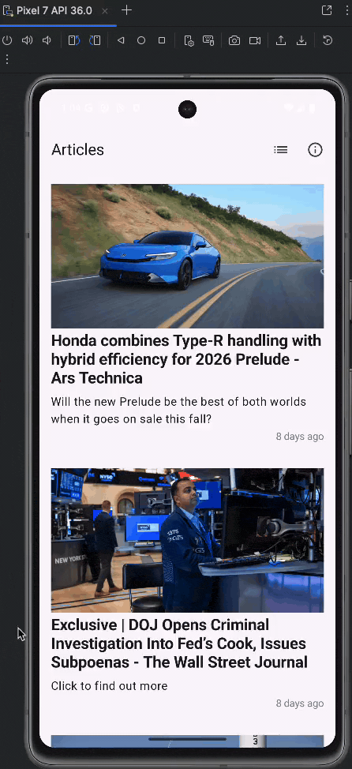
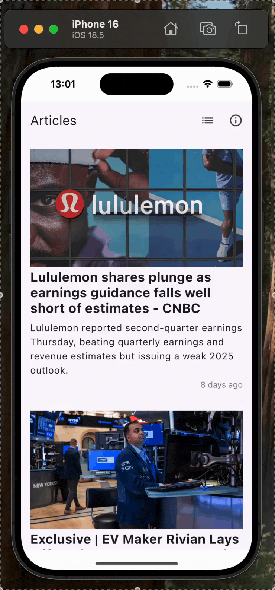
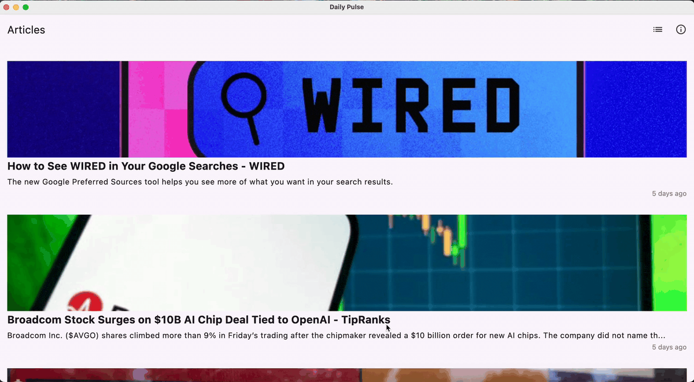
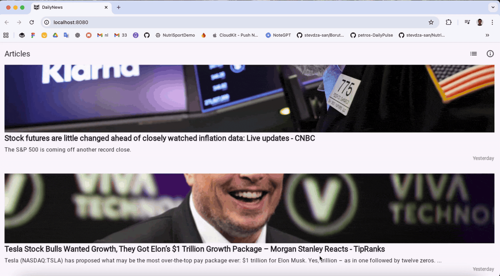

# DailyNews

Compose Multiplatform news app targeting **Android**, **iOS**, **Desktop (JVM)** and **Web (Wasm)**.  
One codebase, four platforms — shared Kotlin Multiplatform (KMP) business logic with Clean Architecture & MVI.

  
  
  
  
  

## Showcase by platform
- [Android](#android)
- [iOS](#ios)
- [Desktop](#desktop)
- [Web](#web)

---

### Android

  <picture>
    <source srcset="assets/showcase/android.webp" type="image/webp">
    
  </picture>

### iOS

  <picture>
    <source srcset="assets/showcase/ios.webp" type="image/webp">
    
  </picture>

### Desktop

  <picture>
    <source srcset="assets/showcase/desktop.webp" type="image/webp">
    
  </picture>

### Web

  <picture>
    <source srcset="assets/showcase/web.webp" type="image/webp">
    
  </picture>

---

## Highlights
- **Single codebase → 4 platforms** (Android, iOS, Desktop, Web/Wasm)
- **Clean Architecture + MVI** presentation (State, Intent, Reducer)
- **Shared data layer** with Ktor (HTTP) and SQLDelight (storage)
- **Dependency Injection** via Koin
- **Compose UI** across all targets

## Project Structure

| Module | Platform(s) | Purpose |
|---|---|---|
| `shared/` 🧠 | All | KMP business logic — **domain**, **data**, **MVI** (state, intent, reducer) |
| `composeApp/` 🤖 | Android | Jetpack Compose app shell + DI (Koin) |
| `iosApp/` 🍎 | iOS | SwiftUI/UIKit host using the shared KMP layer |
| `desktop/` 🖥️ | Desktop (JVM) | Compose Desktop app |
| `web/` 🌐 | Web (Wasm) | Compose Multiplatform (Wasm) app |

  
<strong>Mini folder tree (tap to expand)</strong>

  <pre><code>shared/
 ├─ domain/          # use cases, models
 ├─ data/            # repositories, Ktor, SQLDelight
 └─ presentation/    # MVI: state, intent, reducer
composeApp/
 └─ src/
iosApp/
desktop/
web/
  </code></pre>

## Getting Started (very short)
- Clone the repo and open in **Android Studio** (latest stable with KMP support).
- For iOS: open `iosApp/` in Xcode to run on a simulator/device.
- For Desktop/Web: run the corresponding Gradle run configurations from the IDE.

## Tech Stack
- **Language:** Kotlin (Multiplatform)
- **UI:** Compose Multiplatform (Jetpack Compose on Android/Desktop; Compose for Web/Wasm)
- **DI:** Koin
- **Networking:** Ktor
- **Persistence:** SQLDelight

---
